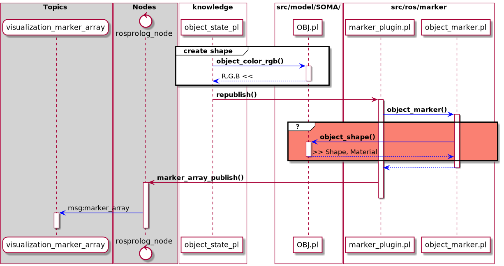

========================
️👨‍💻 Current State
========================

 .. list-table::
    :widths: 50

    * - to accomplish the publishing of the visualization_marker__array msg we must make use of the knowrob/src/ros/marker/marker_plugin.pl
    * - namely the **republish/0** predicate
    * - this predicate calls several functions in the marker_plugin/object_marker.pl
    * - one of those calls result in the invocation of **object_shape_/5** from the src/model/SOMA/OBJ.pl module
    * - this is in part not fully understood and potentially bugged

.. code-block:: prolog

    % Collect possible object shapes
    findall([Obj0,[RGB0,Alpha0],[Pos0,Rot0],ShapeAttributes0],
	        % calling all aggregate and ask() related predicates on their own
			(ask(triple(Obj0,soma:hasShape,Shape)),
			ignore(once(ask(triple(Obj0,soma:hasColor,Color)))),
			ignore(once(ask(triple(Color,dul:hasRegion,CR)))),
			ignore(ask(triple(CR,soma:hasRGBValue,RGB0))),
			ignore(ask(triple(CR,soma:hasTransparencyValue,Alpha0))),
			once(ask(triple(Shape,dul:hasRegion,SR))),
			ignore(once(ask(triple(SR,'http://knowrob.org/kb/urdf.owl#hasOrigin',Origin)))),
			ignore(once(ask(triple(Origin, soma:hasPositionVector, term(Pos0))))),
			ignore(once(ask(triple(Origin, soma:hasOrientationVector, term(Rot0))))),
			findall([SRPredicate, SRObject],ask(triple(SR, SRPredicate,SRObject)), ShapeAttributes0)),
    %	ask(
    %		aggregate([
    %			triple(Obj0,soma:hasShape,Shape),
    %			%% get object color
    %			ignore(once(triple(Obj0,soma:hasColor,Color))),
    %			ignore(once(triple(Color,dul:hasRegion,CR))),
    %			ignore(triple(CR,soma:hasRGBValue,RGB0)),
    %			ignore(triple(CR,soma:hasTransparencyValue,Alpha0)),
    %			%%
    %			once(triple(Shape,dul:hasRegion,SR)),
    %			%% get the shape origin
    %			ignore(once(triple(SR,'http://knowrob.org/kb/urdf.owl#hasOrigin',Origin))),
    %			ignore(once(triple(Origin, soma:hasPositionVector, term(Pos0)))),
    %			ignore(once(triple(Origin, soma:hasOrientationVector, term(Rot0)))),
    %			% get all attributes of ShapeRegion
    %			findall(SRA,triple(SR,_,SRA), ShapeAttributes0)
    %		])
    %		),
		ObjectShapes
	),
    write_ln(ObjectShapes),
    member([Obj,[RGB,Alpha],[Pos1,Rot1],ShapeAttributes1],ObjectShapes),
    ros_info('===== # another findall/3'),
    findall([P1,O1], (
		member(Doc1, ShapeAttributes1),
		member(p-string(P1), Doc1),
		member(o-Ox, Doc1),
		Ox=..[_,O1]
	), ShapeAttributes),  %  ShapeAttributes is not set in this function
    ros_info('===== # rdf_split'),
    rdf_split_url(_,Frame,Obj),
    ShapeID=Frame,
    ros_info('===== # shape_data2()'),
    shape_data2(ShapeAttributes,ShapeTerm), % here the empty list causes the predicate to fail

