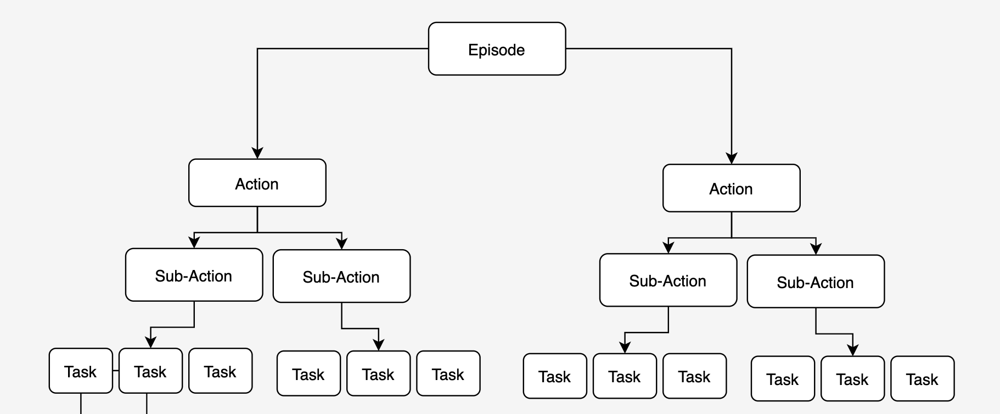

# neem-logging-guide
This guide will give a comprehensive overview of the **suturo-neem-logger** and its practices, alongside an useful introduction into the concepts of **NEEMs**.
Please notice that a similar kind of content already exists in the **Final Report 20/21**. This file is to be seen as an hands-on developer-guide for beginners.  

-----------------

### About NEEMs
The term NEEM is an abbreviation for **N**arrarive **E**nabled **E**pisodic **M**emories. 
 
Conceptionally, it represents the robots memories about its past experiences. 
For instance the memory of a plan that was executed before, where every action can be seen as a task and the whole plan as an Episode.
 
Technically speaking it is a set of logged data within the **mongo DB** that consists of rich semantical & numerical data.
 
During plan execution, the robot is able to log its perceived environment and to export the memorised logs into a NEEM-folder. This folder can be later loaded into any kind of **mongo DB** as a new Collection.
 
For further guidance please visit the KnowRob webiste: http://knowrob.org and consult the NEEM-Handbook:  https://ease-crc.github.io/soma/owl/current/NEEM-Handbook.pdf

### About SOMA

The term SOMA is an abbreviation for  **S**ocio-**p**hysical **M**odel of **A**ctivities. 
 
It is an Ontology that contains an extensive amount of knowledge, necessary to represent actions & relations in the context of household robotics.
 
The SOMA ontologies can be used to log the robots actions in an expressive way. For instance to correctly represent the affordances and roles of objects and actors within the perceived environment of the agent.
 
For further guidance please visit the webiste:
https://ease-crc.github.io/soma/

-----------------

### suturo-neem-logger

The **suturo-neem-logger** is a set of modules and features with which one can generate NEEMS from SUTURO plans.
 
Currently, it is represented within the two branches of **neem-testing** (planning) & **suturo-neem-logger** (knowledge). 

#### neem-testing (planning)
##### execute-cleanup.lisp
- This file is the main entry point of the plan execution
- Currently we worked on the **clean up** plan to test out the NEEM-logging, however it can be applied to any other plan
- In here we start the logging & execute the actions 
- Please consider that there are also multiple **execute-neem-plan-x.lisp**, which consist of smaller plans to test the log functionality

##### prolog-neem-queries.lisp
- This file contains the low-level-interface (llif) to knowledge
- All predicates called in the **execute-cleanup.lisp** are defined here

#### suturo-neem-logger (knowledge)

##### general_logs.pl
- This module holds general functions to start & conclude the logging

##### general_logs.pl
- This module holds

#### neem-team

### logging a plan

- planning-knowledge
- naming conventions

### extending the functionality
-----------------

### Fruther references
##### CRAM Cloud Logger (ccl)
##### open concepts
- what about data from other components?

<!-- -->
<!--! [soma](images/SOMA.png)-->