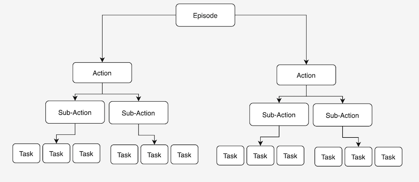

- go through the plan
- everytime you come over a valuable execution, log it

#### about the calls in the execute.lisp
##### open concepts
- what about data from other components?
#### about the calls in the prolog-neem-queries.lisp
#### naming conventions
##### execute.lisp
- some-execution
##### prolog-neem-queries.lisp
- log-some-execution
##### xyz_logging.pl
- some-execution-logging
